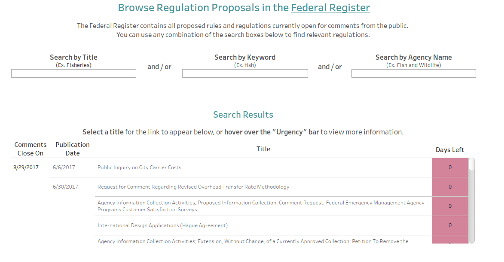

# Regulations Dashboard

### A scientist-friendly interface to public policy

The following scripts retrieve and maintain a list of documents in the Federal Register that are currently open for comment. This forms the back-end of a search tool to help scientists stay up-to-date with federal policy changes about which their research could provide valuable information. The search tool is part of the [Public Comment Project](https://publiccommentproject.org/), a large, interdisciplinary effort to streamline the process of public comment by scientists, as a way to increase efficacy of research and expand outreach.

Visit the [Public Comment Project](https://publiccommentproject.org/) to use the tool and learn more.

### Script details
   + `03_functions.R` retrieves new records using the Federal Register API   
   + `04_update_records.R` creates a Google Sheet of current records and generates transfer files of records that need to be deleted or appended.  
   + `05_delete_rows.py` deletes obsolete rows from the Google Sheet using the Python interface to the Sheets API, due to limitations in the googlesheets package for R.  
   + `06_add_rows.R` then appends new rows, relayed in a temporary transfer file.  

These files are intended to be run in sequence by a task scheduler.  

Files `dash_lastRun.txt`, `client_secret.json`, and `fedRegOut.csv` are all generated by the other scripts, and do not need to be managed.

---
### Contact the author
Mike Vlah:
+ vlahm13@gmail[dot]com
+ [linkedin](https://www.linkedin.com/in/michaelvlah)
